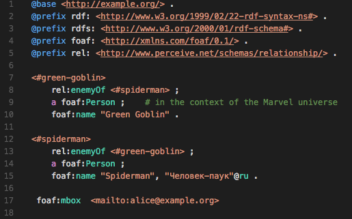

# Stardog RDF Grammars

Syntax highlighting for all your favorite RDF languages, and a few Stardog-specific ones, too!



### RDF language support:

- SPARQL (`.rq`)
- Turtle (`.ttl`)

### Stardog language support:

- Stardog Mapping Syntax (`.sms`)

## Installation

It's not hosted in VSCode's extension library yet, so to install it you'll need to copy this directory into VSCode's dotfile (usually located in your `$HOME` directory):

```
cp path/to/stardog-rdf-grammars $HOME/.vscode/extensions
```

Make sure you have VSCode installed first!  Once you've copied this directory to `.vscode/extensions`, either restart VSCode or reload the window (`CMD+SHIFT+P`, then type `reload` - you'll see the appropriate option).

Open a file with an extension that matches your language, et voila!